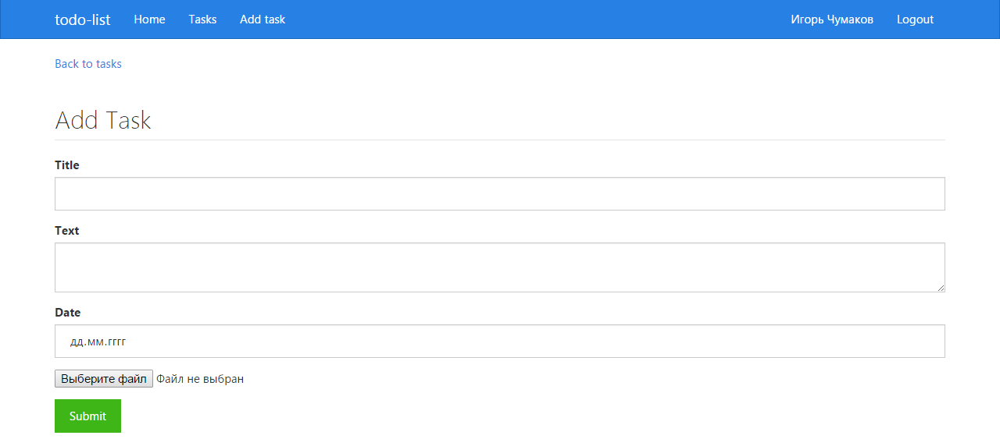
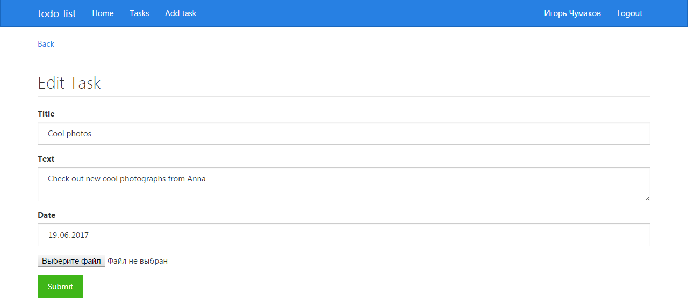
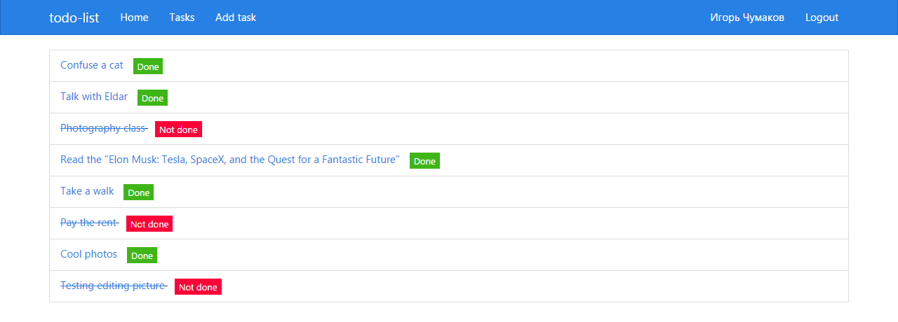
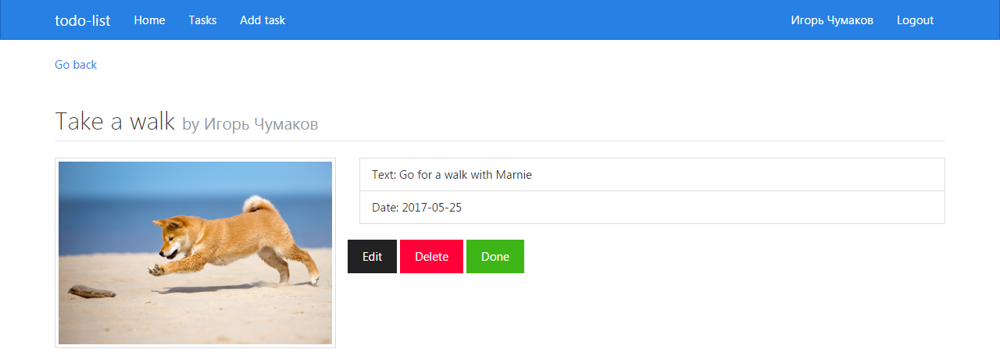

# TodoList

This project was generated with [Angular CLI](https://github.com/angular/angular-cli) version 1.0.3.

To use the functionality of this project you should log in into your Google account.

## Development server

Run `ng serve` for a dev server. Navigate to `http://localhost:4200/`. The app will automatically reload if you change any of the source files.

# Screenshots

To add task you should fill "title", "text" and "date" fields. Also you can add a picture to the task.

You can edit a task and a picture on the edit-task page:

On the tasks page you can see the list of all tasks that store in firebase:

On the task page you can see the info about the task:

